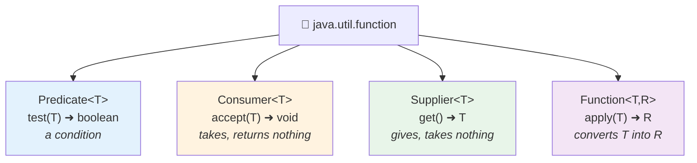

<div align="center">


  

</div>

---

> **In one line:** An interface with exactly one abstract method — the target type of every lambda.

## 🧠 1. What Is It?

A **functional interface** is an interface that contains **exactly one abstract method**. It may also contain any number of `default` and `static` methods. It is the **target type** for a lambda expression.

The optional `@FunctionalInterface` annotation makes the compiler enforce the single-abstract-method rule.

## 🧩 2. The Four Predefined Ones



| Interface | Method | Takes | Returns | Typical use |
|---|---|---|---|---|
| `Predicate<T>` | `test()` | 1 value | `boolean` | Filtering |
| `Consumer<T>` | `accept()` | 1 value | nothing | Printing, saving |
| `Supplier<T>` | `get()` | nothing | a value | Generating, lazy creation |
| `Function<T,R>` | `apply()` | 1 value | another value | Mapping, conversion |

## 🔗 3. Combining Them

| Helper | Belongs to | Effect |
|---|---|---|
| `and()`, `or()`, `negate()` | `Predicate` | Joins conditions |
| `andThen()` | `Function`, `Consumer` | Runs one, then the next |
| `compose()` | `Function` | Runs the other one first |

Two-argument variants also exist: `BiPredicate`, `BiConsumer` and `BiFunction`.

## 🧾 4. Syntax

```java
@FunctionalInterface
interface Calculator {
    int operate(int a, int b);
}

Calculator add = (a, b) -> a + b;
```

## 📌 5. Important Rules

- Exactly **one** abstract method; `default` and `static` methods do not count.
- Methods inherited from `Object`, such as `toString()`, do not count either.
- Older interfaces like `Runnable`, `Callable` and `Comparator` are functional interfaces too.

## 🔁 6. Quick Revision

> One abstract method = a lambda target. Predicate ➜ boolean, Consumer ➜ void, Supplier ➜ value, Function ➜ conversion.

---

<div align="center">

<a href="03-Lambda-Expressions.md">⬅️ Lambda Expressions</a> &nbsp;•&nbsp; <a href="../README.md">🏠 Home</a> &nbsp;•&nbsp; <a href="05-Stream-API.md">Stream API ➡️</a>


<sub>📘 Core Java Theory Notes • Maintained by <b>Kundan</b></sub>

</div>
