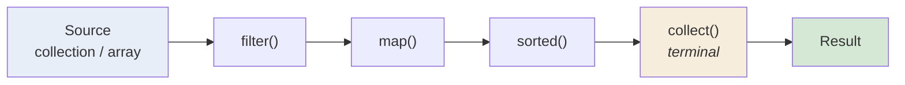

<div align="center">


  

</div>

---

> **In one line:** A declarative pipeline for processing collections: filter, map, sort, collect.

## 1. What Is It?

The **Stream API** processes a group of objects in a **declarative** way — you describe *what* you want, not *how* to loop. A stream is **not** a data structure; it does not store elements and it never modifies the source.

## 2. The Pipeline



Every pipeline has three parts: a **source**, zero or more **intermediate** operations, and exactly one **terminal** operation.

## 3. Intermediate vs Terminal

| | Intermediate | Terminal |
|---|---|---|
| Returns | Another stream | A result or nothing |
| Evaluation | **Lazy** — nothing runs yet | **Eager** — triggers the whole pipeline |
| Examples | `filter`, `map`, `sorted`, `distinct`, `limit`, `skip`, `peek` | `collect`, `forEach`, `count`, `reduce`, `min`, `max`, `anyMatch`, `findFirst` |

## 4. Operation Groups

| Group | Operations |
|---|---|
| **Filtering** | `filter()`, `distinct()` |
| **Mapping** | `map()`, `flatMap()` |
| **Slicing** | `limit()`, `skip()` |
| **Matching** | `anyMatch()`, `allMatch()`, `noneMatch()` |
| **Finding** | `findFirst()`, `findAny()` |
| **Reducing** | `reduce()`, `count()`, `min()`, `max()` |
| **Collecting** | `collect(Collectors.toList())`, `joining()`, `groupingBy()`, `partitioningBy()` |

## 5. Syntax

```java
list.stream()
    .filter(n -> n > 10)
    .map(n -> n * 2)
    .collect(Collectors.toList());
```

## 6. Parallel Streams

`parallelStream()` splits the work across multiple threads using the common ForkJoin pool. It helps only with large data sets and stateless operations, and the result order may change.

## 7. Important Rules

- A stream can be consumed **only once**; reusing it throws `IllegalStateException`.
- Nothing executes until a terminal operation is called.
- The source collection is never modified.

## 8. In Depth

A stream is best understood as a **pipeline description**, not a collection. Nothing is stored and nothing runs until a terminal operation is invoked, at which point the source is traversed **once** and every intermediate operation is applied to each element as it passes — not as a series of separate passes.

That laziness enables two important behaviours. **Short-circuiting** means `findFirst()`, `anyMatch()` and `limit()` stop as soon as the answer is known, so an infinite stream from `Stream.iterate()` is usable. **Fusion** means `filter().map()` performs one traversal rather than two, and never builds an intermediate list.

**Parallel streams deserve caution.** `parallelStream()` splits work across the common ForkJoin pool, which helps only when the data set is large, the per-element work is substantial, the source splits evenly (an `ArrayList` does; a `LinkedList` does not) and the operations are stateless and side-effect free. Otherwise the coordination overhead makes it slower than a sequential loop.

**`reduce` versus `collect`.** `reduce` combines elements into a single immutable value, such as a sum. `collect` accumulates into a mutable container and is the right tool for building lists, maps and strings. `Collectors.groupingBy()` and `partitioningBy()` express in one line what would otherwise be a loop with a map and a null check.

Streams are a readability tool, not automatically a performance tool. A simple indexed loop is often faster; streams win when the alternative is deeply nested loops and temporary collections.

## 9. Quick Revision

> source → intermediate (lazy) → terminal (eager). One-time use, no mutation, `collect()` brings the data back.

---

<div align="center">

<a href="04-Functional-Interfaces.md">← Functional Interfaces</a> &nbsp;•&nbsp; <a href="../README.md">Home</a> &nbsp;•&nbsp; <a href="06-Method-References.md">Method References →</a>


<sub>Core Java Theory Notes • Maintained by <b>Kundan</b></sub>

</div>
