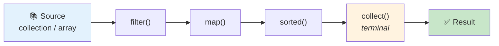

<div align="center">


  

</div>

---

> **In one line:** A declarative pipeline for processing collections: filter, map, sort, collect.

## 🧠 1. What Is It?

The **Stream API** processes a group of objects in a **declarative** way — you describe *what* you want, not *how* to loop. A stream is **not** a data structure; it does not store elements and it never modifies the source.

## 🧩 2. The Pipeline



Every pipeline has three parts: a **source**, zero or more **intermediate** operations, and exactly one **terminal** operation.

## 📋 3. Intermediate vs Terminal

| | Intermediate | Terminal |
|---|---|---|
| Returns | Another stream | A result or nothing |
| Evaluation | **Lazy** — nothing runs yet | **Eager** — triggers the whole pipeline |
| Examples | `filter`, `map`, `sorted`, `distinct`, `limit`, `skip`, `peek` | `collect`, `forEach`, `count`, `reduce`, `min`, `max`, `anyMatch`, `findFirst` |

## 🧰 4. Operation Groups

| Group | Operations |
|---|---|
| **Filtering** | `filter()`, `distinct()` |
| **Mapping** | `map()`, `flatMap()` |
| **Slicing** | `limit()`, `skip()` |
| **Matching** | `anyMatch()`, `allMatch()`, `noneMatch()` |
| **Finding** | `findFirst()`, `findAny()` |
| **Reducing** | `reduce()`, `count()`, `min()`, `max()` |
| **Collecting** | `collect(Collectors.toList())`, `joining()`, `groupingBy()`, `partitioningBy()` |

## 🧾 5. Syntax

```java
list.stream()
    .filter(n -> n > 10)
    .map(n -> n * 2)
    .collect(Collectors.toList());
```

## ⚡ 6. Parallel Streams

`parallelStream()` splits the work across multiple threads using the common ForkJoin pool. It helps only with large data sets and stateless operations, and the result order may change.

## 📌 7. Important Rules

- A stream can be consumed **only once**; reusing it throws `IllegalStateException`.
- Nothing executes until a terminal operation is called.
- The source collection is never modified.

## 🔁 8. Quick Revision

> source ➜ intermediate (lazy) ➜ terminal (eager). One-time use, no mutation, `collect()` brings the data back.

---

<div align="center">

<a href="04-Functional-Interfaces.md">⬅️ Functional Interfaces</a> &nbsp;•&nbsp; <a href="../README.md">🏠 Home</a> &nbsp;•&nbsp; <a href="06-Method-References.md">Method References ➡️</a>


<sub>📘 Core Java Theory Notes • Maintained by <b>Kundan</b></sub>

</div>
