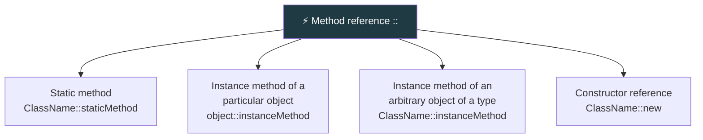

  

---

> **In one line:** A shorthand for a lambda that does nothing but call an existing method.

## 🧠 1. What Is It?

A **method reference** is a compact alternative to a lambda whose body only calls an existing method. It uses the **`::`** operator.

## 🧩 2. Four Forms

## 📋 3. Lambda vs Method Reference

| Lambda | Method reference |
|---|---|
| `x -> Math.abs(x)` | `Math::abs` |
| `s -> System.out.println(s)` | `System.out::println` |
| `s -> s.toUpperCase()` | `String::toUpperCase` |
| `() -> new ArrayList<>()` | `ArrayList::new` |

## 📌 4. Important Rules

- The referenced method's parameters and return type must match the functional interface's abstract method.
- A method reference cannot pass extra arguments or add logic — if anything more is needed, keep the lambda.

## 🔁 5. Quick Revision

> `::` replaces a lambda that only forwards a call. Four forms: static, bound instance, unbound instance, constructor.

---

<a href="05-Stream-API.md">⬅️ Stream API</a> &nbsp;•&nbsp; <a href="../README.md">🏠 Home</a> &nbsp;•&nbsp; <a href="07-Optional-Class.md">Optional Class ➡️</a>

📘 Core Java Theory Notes • Maintained by <b>Kundan</b>

