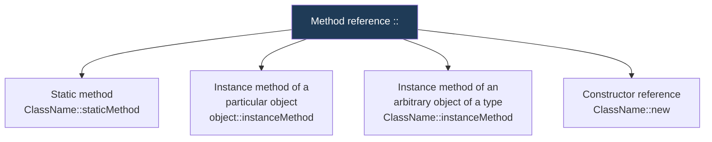

  

---

> **In one line:** A shorthand for a lambda that does nothing but call an existing method.

## 1. What Is It?

A **method reference** is a compact alternative to a lambda whose body only calls an existing method. It uses the **`::`** operator.

## 2. Four Forms

## 3. Lambda vs Method Reference

| Lambda | Method reference |
|---|---|
| `x -> Math.abs(x)` | `Math::abs` |
| `s -> System.out.println(s)` | `System.out::println` |
| `s -> s.toUpperCase()` | `String::toUpperCase` |
| `() -> new ArrayList<>()` | `ArrayList::new` |

## 4. Important Rules

- The referenced method's parameters and return type must match the functional interface's abstract method.
- A method reference cannot pass extra arguments or add logic — if anything more is needed, keep the lambda.

## 5. In Depth

A method reference is compiled exactly like the equivalent lambda, so the choice between them is entirely about readability. The rule of thumb: if the lambda body is a single call that simply forwards its parameters, the method reference says the same thing with less noise.

The form that confuses people is the **unbound instance reference**, `String::toUpperCase`. It looks like a call on the class, but it means "for whichever instance is supplied as the first argument, call this method on it", so it matches `Function<String, String>`. Compare it with `System.out::println`, where the receiver is fixed at the moment the reference is created.

**Constructor references** — `ArrayList::new`, `Employee::new` — fit any functional interface whose abstract method has matching parameters, which is what makes them work as factories in `Collectors.toCollection(TreeSet::new)` or `Stream.toArray(String[]::new)`.

The compiler resolves which form is meant from the target type, so the same syntax can mean different things in different contexts. A method reference cannot add logic, reorder arguments or supply extra values; the moment any of that is needed, the lambda is the correct tool.

## 6. Quick Revision

> `::` replaces a lambda that only forwards a call. Four forms: static, bound instance, unbound instance, constructor.

---

<a href="05-Stream-API.md">← Stream API</a> &nbsp;•&nbsp; <a href="../README.md">Home</a> &nbsp;•&nbsp; <a href="07-Optional-Class.md">Optional Class →</a>

Core Java Theory Notes • Maintained by <b>Kundan</b>

