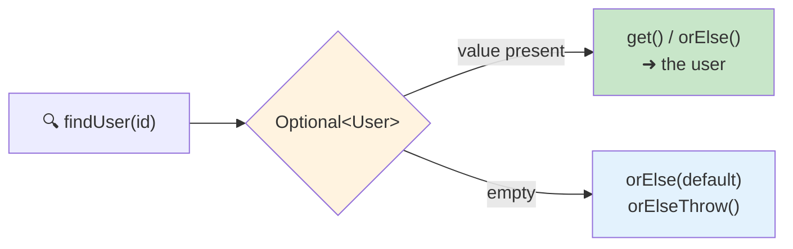

  

---

> **In one line:** A container object that may or may not hold a value, designed to avoid NullPointerException.

## 🧠 1. What Is It?

`java.util.Optional<T>` is a **container object** that may or may not contain a non-null value. It makes the possibility of "no value" explicit in the type, instead of silently returning `null`.

## 🧩 2. The Idea

## 📋 3. Creating And Using

| Method | Purpose |
|---|---|
| `Optional.of(value)` | Wraps a non-null value; throws if it is null |
| `Optional.ofNullable(value)` | Wraps a value that may be null |
| `Optional.empty()` | An empty container |
| `isPresent()` / `isEmpty()` | Checks for a value |
| `get()` | Returns the value — throws if empty |
| `orElse(default)` | Value, or a fallback |
| `orElseGet(supplier)` | Value, or a lazily created fallback |
| `orElseThrow()` | Value, or a chosen exception |
| `ifPresent(consumer)` | Runs an action only when a value exists |
| `map()` / `filter()` | Transforms or tests the contained value |

## ⚠️ 4. Common Mistakes

- Calling `get()` without checking, which reintroduces the very crash Optional was designed to prevent.
- Using `Optional` for fields or method parameters — it is intended mainly for **return types**.

## 🔁 5. Quick Revision

> `Optional` makes "maybe no value" explicit. Prefer `orElse` / `ifPresent` over `get()`.

---

<a href="06-Method-References.md">⬅️ Method References</a> &nbsp;•&nbsp; <a href="../README.md">🏠 Home</a> &nbsp;•&nbsp; <a href="08-Date-and-Time-API.md">Date and Time API ➡️</a>

📘 Core Java Theory Notes • Maintained by <b>Kundan</b>

