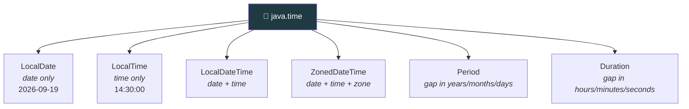

  

---

> **In one line:** An immutable, thread-safe replacement for the old Date and Calendar classes.

## 🧠 1. What Is It?

Java 8 introduced the **`java.time`** package to replace the old `java.util.Date` and `Calendar` classes, which were **mutable, not thread safe** and confusing (months started at 0, years counted from 1900).

## 🧩 2. Core Classes

## 📋 3. Common Operations

| Need | Method |
|---|---|
| Today's date | `LocalDate.now()` |
| A specific date | `LocalDate.of(2026, 9, 19)` |
| Add or subtract | `plusDays()`, `minusMonths()` |
| Compare | `isBefore()`, `isAfter()`, `isEqual()` |
| Gap between dates | `Period.between(d1, d2)` |
| Gap between times | `Duration.between(t1, t2)` |
| Format | `DateTimeFormatter.ofPattern("dd-MM-yyyy")` |

## ✅ 4. Why It Is Better

| Old API | New API |
|---|---|
| Mutable | **Immutable** |
| Not thread safe | **Thread safe** |
| Months start at 0 | Months start at 1 |
| One class doing everything | Separate, clearly named classes |
| `SimpleDateFormat` not thread safe | `DateTimeFormatter` is thread safe |

## 📌 5. Important Rules

- Every `java.time` object is immutable, so every operation returns a **new** object.
- `LocalDate` and `LocalTime` carry **no time zone**; use `ZonedDateTime` when a zone matters.

## 🔁 6. Quick Revision

> `java.time` = immutable + thread safe + clearly separated. `LocalDate`, `LocalTime`, `LocalDateTime`, `Period`, `Duration`.

---

<a href="07-Optional-Class.md">⬅️ Optional Class</a> &nbsp;•&nbsp; <a href="../README.md">🏠 Home</a> &nbsp;•&nbsp; <i>End</i> ➡️

📘 Core Java Theory Notes • Maintained by <b>Kundan</b>

