  

---

> The release that changed Java's coding style: interface changes, lambdas, functional interfaces, streams, method references, Optional and the new Date & Time API.

## 📚 Topics In This Chapter

| # | Topic | What you will learn |
|---|---|---|
| 01 | [Java 8 Introduction](./01-Java-8-Introduction.md) | The aims of Java 8 and an overview of every new feature |
| 02 | [Interface Changes](./02-Interface-Changes.md) | default and static methods inside interfaces |
| 03 | [Lambda Expressions](./03-Lambda-Expressions.md) | Writing anonymous functions with the arrow syntax |
| 04 | [Functional Interfaces](./04-Functional-Interfaces.md) | @FunctionalInterface and the four predefined ones |
| 05 | [Stream API](./05-Stream-API.md) | Processing collections declaratively with stream pipelines |
| 06 | [Method References](./06-Method-References.md) | The :: operator and its four forms |
| 07 | [Optional Class](./07-Optional-Class.md) | Avoiding NullPointerException with a value container |
| 08 | [Date and Time API](./08-Date-and-Time-API.md) | The modern java.time API and why it replaced Date and Calendar |

## 🗺️ Learning Path

```mermaid
flowchart LR
    N0["01. Java 8 Introduction"]
    N0 --> N1
    N1["02. Interface Changes"]
    N1 --> N2
    N2["03. Lambda Expressions"]
    N2 --> N3
    N3["04. Functional Interfaces"]
    N3 --> N4
    N4["05. Stream API"]
    N4 --> N5
    N5["06. Method References"]
    N5 --> N6
    N6["07. Optional Class"]
    N6 --> N7
    N7["08. Date and Time API"]
```

---

<a href="../11-Advanced-Concepts/README.md">⬅️ Inner Classes</a> &nbsp;•&nbsp; <a href="../README.md">🏠 Home</a> &nbsp;•&nbsp; <i>End of notes</i> ➡️

📘 Core Java Theory Notes • Maintained by <b>Kundan</b>

