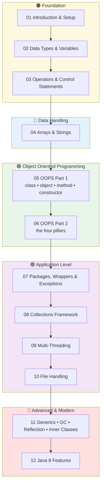
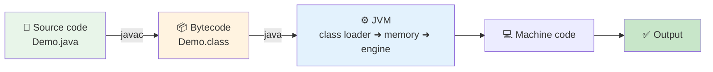

<div align="center">


    

</div>

---

## 📖 About These Notes

A complete, diagram-first set of **Core Java theory notes** covering the full syllabus in 12 chapters.
Every topic follows the same predictable shape, so revision is fast:

> **What it is ➜ Why we need it ➜ Diagram ➜ How it works ➜ Rules ➜ Common mistakes ➜ Quick revision**

These are **theory notes, not a code repository**. Code appears only as short syntax snippets where the syntax itself is the concept.

## 🗂️ Chapters

| # | Chapter | Topics | Open |
|---|---|---|---|
| 01 | **Java Introduction & Setup** | 10 | [Read ➜](./01-Java-Introduction-and-Setup/README.md) |
| 02 | **Data Types & Variables** | 7 | [Read ➜](./02-Data-Types-and-Variables/README.md) |
| 03 | **Operators & Control Statements** | 5 | [Read ➜](./03-Operators-and-Control-Statements/README.md) |
| 04 | **Arrays & Strings** | 5 | [Read ➜](./04-Arrays-and-Strings/README.md) |
| 05 | **OOPS — Part 1** | 6 | [Read ➜](./05-OOPS-Part-1/README.md) |
| 06 | **OOPS — Part 2** | 8 | [Read ➜](./06-OOPS-Part-2/README.md) |
| 07 | **Packages, Wrapper Classes & Exceptions** | 3 | [Read ➜](./07-Packages-Wrapper-Exceptions/README.md) |
| 08 | **Collections Framework** | 5 | [Read ➜](./08-Collections-Framework/README.md) |
| 09 | **Multi-Threading** | 5 | [Read ➜](./09-Multi-Threading/README.md) |
| 10 | **File Handling** | 5 | [Read ➜](./10-File-Handling/README.md) |
| 11 | **Advanced Concepts** | 4 | [Read ➜](./11-Advanced-Concepts/README.md) |
| 12 | **Java 8 New Features** | 8 | [Read ➜](./12-Java-8-Features/README.md) |

## 🗺️ Complete Roadmap



## 🧭 The One Diagram To Remember



## 📂 Folder Structure

```
Theory/
├── README.md                              ← you are here
├── 01-Java-Introduction-and-Setup/        ← 10 topics
├── 02-Data-Types-and-Variables/           ←  7 topics
├── 03-Operators-and-Control-Statements/   ←  5 topics
├── 04-Arrays-and-Strings/                 ←  5 topics
├── 05-OOPS-Part-1/                        ←  6 topics
├── 06-OOPS-Part-2/                        ←  8 topics
├── 07-Packages-Wrapper-Exceptions/        ←  3 topics
├── 08-Collections-Framework/              ←  5 topics
├── 09-Multi-Threading/                    ←  5 topics
├── 10-File-Handling/                      ←  5 topics
├── 11-Advanced-Concepts/                  ←  4 topics
└── 12-Java-8-Features/                    ←  8 topics

Every folder has its own README.md index, and every topic file
links to the previous topic, the home page and the next topic.
```

## 🧾 Conventions Used

| Symbol | Meaning |
|---|---|
| 🧠 | What the concept is |
| 🧩 | Diagram or flowchart |
| ⚙️ | How it works internally |
| 📋 | Comparison table |
| 🧾 | Syntax |
| 📌 | Important rules |
| ⚠️ | Common mistakes |
| ✅ | Best practices |
| 🔁 | Quick revision |

## 🚀 How To Use

1. Open a chapter `README.md` to see its learning path.
2. Work through the topics in numbered order.
3. Use the ⬅️ / 🏠 / ➡️ links at the bottom of every page to move around.
4. Before a revision session, read only the 🔁 **Quick Revision** lines.

> 💡 Mermaid diagrams render automatically on GitHub — nothing to install.

---

<div align="center">


<sub>📘 Core Java Theory Notes • Written and maintained by <b>Kundan</b></sub>

</div>
